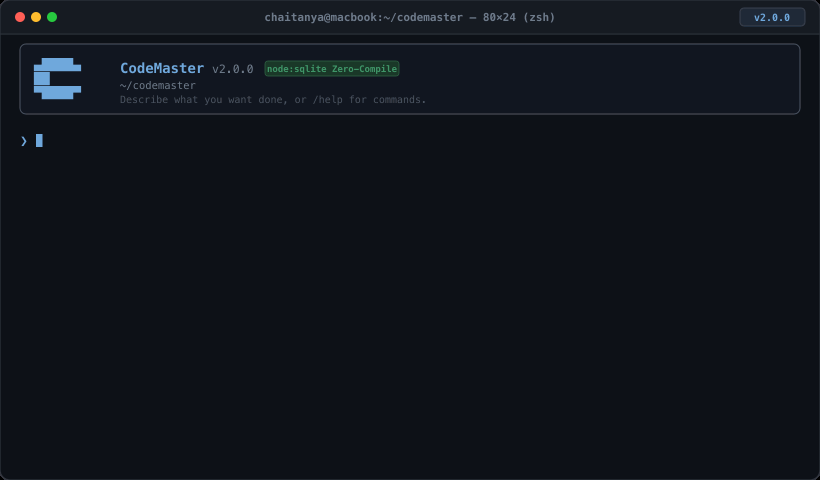

```
  ▄████▄
  ██        CodeMaster
  ▀████▀    A persistent reasoning layer for AI software engineering
```

> The model is a replaceable CPU. CodeMaster is the layer beneath it.

CodeMaster treats LLMs as interchangeable execution engines and supplies the
persistent layer they lack: structured session state, a knowledge wiki,
deterministic repository intelligence, reasoning stored once and replayed
forever, and provider-agnostic checkpointing.

This file is the operational guide. [SPEC.md](SPEC.md) is the complete technical architecture and specification document.

---

<p align="center">
  
  <br />
  <em><strong>CodeMaster v2.0.0 TUI</strong> in action: Zero-compile node:sqlite, multi-phase stepping, TokenJuice compression, calibrated memory recall &amp; AST surgical edits.</em>
</p>

---

## Single-Command Installation

Install CodeMaster with a single command:

```bash
# Option 1: Direct one-line installer
curl -fsSL https://raw.githubusercontent.com/Chai-B/CodeMaster/main/install.sh | bash
```

```bash
# Option 2: Global npm package
npm install -g codemaster
```

Or from a git clone:

```bash
git clone https://github.com/Chai-B/CodeMaster
cd CodeMaster
./install.sh
```

**Requires Node.js 22.5+** — CodeMaster uses built-in `node:sqlite`, requiring no native C++ modules or build tools to compile.

Optional, each degrades gracefully if absent: `ripgrep` for faster search,
`pyright` / `typescript-language-server` for LSP queries. The local embedding
model (`Xenova/all-MiniLM-L6-v2`) downloads once on first `/reindex` and then
runs offline.

---

## Credentials

CodeMaster holds keys for several vendors **at the same time** and picks one per
call. Two ways to give it a key.

**Environment variables** — read directly, nothing to store:

| Vendor | Variables |
|---|---|
| Anthropic | `ANTHROPIC_API_KEY`, `ANTHROPIC_AUTH_TOKEN`, `CLAUDE_CODE_OAUTH_TOKEN` |
| OpenAI / Codex | `OPENAI_API_KEY` |
| Google | `GEMINI_API_KEY`, `GOOGLE_API_KEY` |

An authenticated `claude` CLI (`claude setup-token`) also counts as an Anthropic
credential.

**Stored accounts** — `/account`, for holding more than one key per vendor:

```
/account                                   list accounts, mark the active one
/account add anthropic work sk-ant-…       store a key under an alias
/account add openai personal sk-…          a second vendor, at the same time
/account use work                          choose which account answers
/account remove personal
```

The key is written through `CredentialManager`, which tries the OS keychain
first (macOS `security`, Linux `secret-tool`), falls back to an AES-256-GCM file
encrypted with `CODEMASTER_MASTER_PASSWORD`, and only then to plaintext. Pick
the backend explicitly with `security.credential_backend`.

The line you typed carries a secret, so it is never added to the input history
and the key is masked in the transcript.

`/account` shows, per account, whether its credential actually resolves.
`/doctor` reports the same thing across the whole install — a vendor listed but
unresolvable is the failure this is designed to surface before a call, not
during one.

---

## Running it

Four entry points, one state layer:

```bash
codemaster                          # interactive TUI in the current repository
codemaster run "fix the parser"     # plan and execute, then exit (CI, scripts)
codemaster ask "what does resolver.py do?"   # read-only answer, no session
codemaster mcp                      # MCP stdio server for other agents
codemaster proxy --port 7433        # OpenAI-compatible endpoint on 127.0.0.1
```

`run` and `ask` both take `--repo <path>`, `--model <id>` and `--json`, and both
accept the text on stdin instead of as an argument:

```bash
echo "fix the parser" | codemaster run --json
```

`run` exits `0` on a verified run, `1` on task failure, `2` on usage error or an
unverified run, `3` when no provider credential is available.

Inside the TUI, a bare line is routed by shape: a question is answered
read-only, anything else starts a session. The routing is always announced, and
`/new <objective>` forces a session.

---

## Commands

`/help` lists all of them; `/help <group>` or `/<command> --help` narrows.

| Group | Commands |
|---|---|
| Session | `/ask` `/new` `/resume` `/recover` `/pause` `/complete` `/session` `/projects` |
| Planning | `/plan` `/tasks` `/task` `/run` `/runall` `/skip` |
| Provider | `/model` `/provider` `/account` `/handoff` |
| Memory | `/memory` `/wiki` `/reasoning` `/forget` |
| Repository | `/reindex` `/rebuild-map` `/graph` |
| Checkpoint | `/checkpoint` `/checkpoints` `/undo` `/diff` |
| Diagnostic | `/tokens` `/context` `/stats` `/doctor` `/health` `/cost` `/waste` `/why` `/learn` `/workers` `/profile` `/replay` `/verbose` |
| Misc | `/config` `/plugins` `/help` `/clear` `/quit` |

Everything deterministic — `/reindex`, `/graph`, `/wiki`, `/tokens`, `/context`,
`/diff` — works with no credential at all. Only `/ask`, `/plan`, `/run` and
`/runall` call a model.

---

## How a model gets chosen

Work is split into roles: `plan`, `solve`, `oracle`, `review`, `summarize`,
`merge`. Each call routes independently.

With no configuration, the table is **derived** from `providers.default`:
`review`, `summarize` and `merge` are mechanical transforms whose answer is
already in their input, so they take the cheapest model on the default's own
vendor; `plan`, `solve` and `oracle` stay on the default. `oracle` gets medium
reasoning effort — it is the only source of ground truth. Moving
`providers.default` moves the whole table with it.

Override any role from inside the tool:

```
/config set providers.roles.oracle claude-opus-4-8
/config set providers.roles.solve.effort high
/config set providers.pinned true          # never escalate or re-route
```

An unknown role or an unknown model is rejected by name rather than written and
silently ignored. `/model` prints the table in force.

Under a pin, escalation and role routing are both suppressed — a pinned run
measures the model it names. Without a pin, a call that fails on one vendor is
retried on another whose credential resolves.

---

## Interactive TUI & Command Catalog

Launch the interactive terminal session:

```bash
codemaster
```

Within the interactive shell, press `/` to trigger the autocomplete menu or type any command directly:

| Command | Category | Purpose & Capability |
|---|---|---|
| `/help` | General | Complete interactive catalog of all commands and keybindings |
| `/tokens` | Optimization | Real-time TokenJuice compression metrics, pruned lockfiles & budget ladders |
| `/memory` | Memory | Calibrated SQLite FTS5 BM25 + Reciprocal Rank Fusion (RRF) & contradiction resolution |
| `/model` | Routing | 3-axis role routing: Provider (`Google`, `Anthropic`, `OpenAI`), Model Tier & Thinking Effort |
| `/worktree` | Sandboxing | Inspect isolated git scratchpads (`.git/codemaster-worktrees/`) keeping `main` pristine |
| `/diff` | Splicing | Inspect pending AST surgical diffs with byte-level undo journals |
| `/bench` | Evaluation | Run benchmark harness smoke suite (`pass@1`, `Succ/Mtok`, execution latency) |
| `/status` | Diagnostics | Display zero-compile `node:sqlite DatabaseSync` and prompt prefix-cache status |
| `/undo` | Safety | Rollback the most recent AST surgical symbol modification |
| `/clear` | Viewport | Clear the active terminal activity stream without resetting session state |

---

## Where state lives

Machine-global state and per-repository state are separate, and neither lives
inside your working tree — `git clean -fdx` cannot destroy a session's memory.

```
~/.config/codemaster/                 ($XDG_CONFIG_HOME/codemaster)
├── config.yaml                       global config
├── credentials/                      stored keys + the id index
├── logs/
├── plugins/                          drop-in extensions
└── repos/<name>-<hash>/
    ├── repo.json                     which repository this state belongs to
    ├── state.db                      sessions, tasks, reasoning, memory, wiki, tokens, checkpoints
    ├── wiki/                         markdown mirror
    └── sessions/<id>/checkpoints/    self-sufficient snapshots

<repo>/.codemaster/index.db           symbol / file / module index (self-gitignored)
```

`CODEMASTER_DATA_DIR` relocates all of it — used by the test suite, useful for
sandboxing. A pre-0.1 `~/.codemaster/` install is migrated once, automatically.

`/projects` lists every repository CodeMaster holds state for.

---

## The five rules it is built on

1. **Never ask an LLM what a script can answer** — tree-sitter, git, ripgrep,
   dependency and call graphs.
2. **Never ask the same reasoning twice** — every decision is a structured
   object, persisted and replayed.
3. **Never store chats, store state** — sessions, tasks, reasoning, wiki; never
   transcripts.
4. **Never send a whole repository** — a deterministic selector ships ~10–30
   files.
5. **Never allow context drift** — every prompt is compiled from structured
   state, not from history.

---

## Development

```bash
npm test         # node --test over unit / integration / e2e
npm run typecheck
npm run dev      # TUI with reload
```

MIT.
